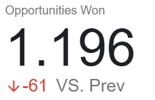
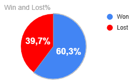
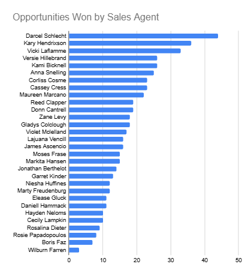
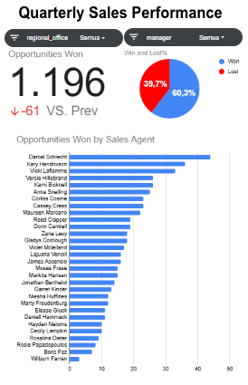

# 📊 CRM Sales Dashboard  
**Build an interactive dashboard to track and analyze quarterly sales performance**  
[🔗 Maven Analytics Guided Project](https://app.mavenanalytics.io/guided-projects/13ce0362-3a49-473d-9421-9e15ee8adfa7)

---

## 📂 Download file dashboard
**CRM Sales Dashboard — Interactive Excel Dashboard**  
[CRM Sales Dashboard.xlsx](https://drive.google.com/drive/folders/1qeegNLCbkvfo1vRJMH4hAgHPVBXPpzO1?usp=sharing)

---

## 📖 Project Overview
Proyek ini merupakan bagian dari **Maven Analytics Guided Projects**, dengan fokus pada pembuatan **dashboard interaktif untuk menganalisis performa penjualan per kuartal**.  
Tujuan utama dashboard adalah membantu tim sales memahami tren penjualan, win rate, serta performa masing-masing sales agent sehingga dapat meningkatkan strategi penjualan.

---

## 🎯 Objectives & Tasks

### 🧩 Objective 1: Prepare the Data for Analysis
Melakukan persiapan dan pembersihan data sebelum analisis.

**Langkah-langkah yang dilakukan:**
- Mengeksplorasi dataset **sales_pipeline.csv** untuk memahami jumlah peluang (opportunities), status won/lost, dan distribusi nilai.  
- Mengkaji dataset **sales_teams.csv** guna memahami struktur tim serta relasi antara sales agent, manager, dan regional office.  
- Menggunakan **XLOOKUP** untuk membawa informasi **manager** dan **regional_office** ke tabel pipeline berdasarkan kolom `sales_agent`.  
- Mengonversi tanggal menjadi format kuartal (Q1, Q2, Q3, Q4).  

---

### 📊 Objective 2: Explore the Data with Pivot Tables
Menganalisis data menggunakan **Excel PivotTables** untuk mengidentifikasi pola dan tren utama.

**Analisis yang dilakukan:**
- **Opportunities Won by Quarter** – melihat tren peluang yang dimenangkan dari waktu ke waktu.  
- **Won vs Lost Percentage** – menghitung persentase kemenangan dan kekalahan.  
- **Opportunities Won per Sales Agent** – menilai performa individual.  
- **Opportunities by Region & Manager** – melihat penyebaran performa tim.

---

### 📈 Objective 3: Build a Dynamic Dashboard
Membangun **dashboard Excel yang interaktif** menggunakan PivotCharts dan Slicer.

**Fitur dashboard:**
- **Scorecard**: Perbandingan peluang menang antara kuartal terbaru dan sebelumnya.  
- **Pie Chart**: Persentase Won vs Lost.  
- **Bar Chart**: Performansi tiap sales agent berdasarkan jumlah peluang yang dimenangkan.  
- **Slicer**: Filter berdasarkan **Regional Office** dan **Sales Manager**.
  
---

## 📸 Preview Visualisasi

  
  

  
  

---

## 💡 Insights & Recommendations
Beberapa temuan utama dari dashboard:

- **Peluang menang menurun** pada quartal 4 dibanding quartal 3.  
- **Darcel Schlecht** sebagai sales agent menunjukkan performa jauh lebih tinggi dan menjadi kontributor utama pada total win di quarter 4.  
- **Win rate pada quartal 4** berada pada angka 60,3% sedangkang lost berada pada 39,7%.  

**Rekomendasi:**
- Mengoptimalkan strategi penjualan untuk agent dengan performa di bawah rata-rata seperti pada **Wilburn Farren, Boris Faz, dan Rosie Papadopoulos** yang memiliki peringkat terendah pada quartal 4.  
- Melakukan review pada region **east** yang memiliki win rate rendah pada quartal 4 untuk meningkatkan efektivitas strategi.  

---

## 🛠️ Tools & Technologies
- **Microsoft Excel**  
- PivotTable & PivotChart  
- Scorecards, Bar & Pie Charts  
- XLOOKUP 
- Slicer for interactive filtering  

---

## ✍️ Author
**ricki309**  
> *Kode proyek bersifat privat. Repository ini hanya berisi dokumentasi dan deskripsi proyek untuk portofolio.*
